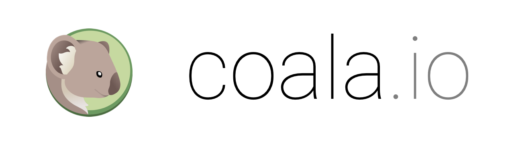

Welcome to coala_pyflakes API Documentation
===========================================

Hey there! You're in the right place if you:

- want to develop coala-bears with pyflakes
- want to develop a generic plugin with pyflakes

If you're trying to **use** coala, you should have a look at our
`user documentation`_ instead.

.. toctree::
   :caption: Home
   :hidden:

   Welcome <self>
   Homepage <http://coala.io/#/home>
   Code of Conduct <http://coala.io/coc>

.. toctree::
   :caption: coala-pyflakes API Documentation
   :maxdepth: 4

   pyflakes_bears
   pyflakes_generic_plugins

.. toctree::
  :caption: For Developers
  :hidden:

  PyFlakesASTBear Guide <Developers/PyFlakesASTBearTutorial>

.. _user documentation: https://docs.coala.io
